<div align="center">

### **[Live App — time-series-forecasting-ml-model.streamlit.app](https://time-series-forecasting-ml-model.streamlit.app/)**

[](https://time-series-forecasting-ml-model.streamlit.app/)

---

# TIME SERIES
### FORECASTING & INVENTORY INTELLIGENCE

**Prophet-powered multi-store demand forecasting — Streamlit dashboard · FastAPI REST service · automated training pipeline**


[](https://time-series-forecasting-ml-model.streamlit.app/)

</div>

---

## Table of Contents

1. [Project Overview](#1-project-overview)
2. [System Architecture](#2-system-architecture)
3. [Repository Structure](#3-repository-structure)
4. [Dataset](#4-dataset)
5. [Feature Engineering](#5-feature-engineering)
6. [Modelling — Facebook Prophet](#6-modelling--facebook-prophet)
7. [Training Pipeline](#7-training-pipeline)
8. [Streamlit Dashboard](#8-streamlit-dashboard)
9. [REST API — FastAPI](#9-rest-api--fastapi)
10. [Live Demo](#10-live-demo)
11. [Usage Guide](#11-usage-guide)
12. [Model Inventory](#12-model-inventory)
13. [Key Insights](#13-key-insights)
14. [Tech Stack](#14-tech-stack)

---

## 1. Project Overview

An **end-to-end time-series demand forecasting system** for a multi-store, multi-product retail warehouse. It trains one **Facebook Prophet** model per store–product pair (100 models total), serialises them as `.joblib` artefacts, and exposes predictions through a **Streamlit dashboard** and a **FastAPI REST API**.

| Capability | Description |
|---|---|
| Per-pair forecasting | One dedicated Prophet model per store × product |
| Horizon flexibility | 7-day, 30-day, or any date up to 4 years ahead |
| Trend intelligence | Auto rise / drop / stable classification |
| Inventory planning | Recommended stock with peak and daily averages |
| Portfolio scanning | Batch trend scan across all 100 pairs |
| Product comparison | Side-by-side forecast for two products |
| Restock alerts | Threshold-based alerting for low-demand pairs |
| REST API | FastAPI service mirroring all dashboard features |

---

## 2. System Architecture

### High-level flow

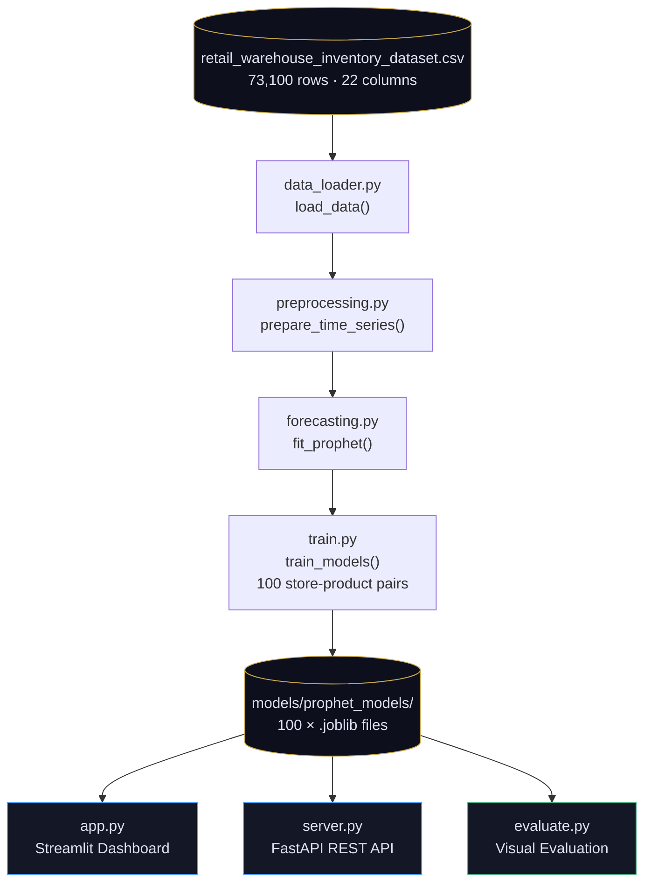

### Preprocessing pipeline

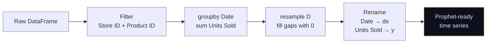

### Inference flow (per request)

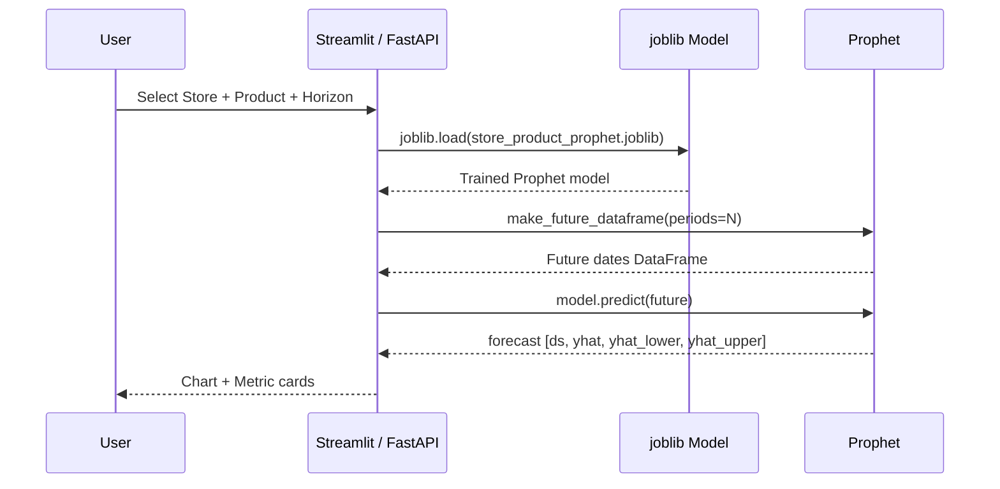

---

## 3. Repository Structure

```
Time-Series-Forecasting/
├── app.py                    Streamlit dashboard (7-tab UI)
├── server.py                 FastAPI REST service
├── main.py                   Training + evaluation entry point
├── requirements.txt
│
├── data/
│   └── retail_warehouse_inventory_dataset.csv
│
├── models/
│   └── prophet_models/
│       ├── S001_P0001_prophet.joblib
│       └── ...               (100 files total)
│
├── notebooks/
│   └── EDA_and_Feature_Engineering.ipynb
│
└── src/
    ├── data_loader.py        load_data()
    ├── preprocessing.py      prepare_time_series()
    ├── forecasting.py        fit_prophet()
    ├── train.py              train_models()
    ├── evaluate.py           evaluate_models()
    └── utils.py              set_seed()
```

---

## 4. Dataset

**File:** `data/retail_warehouse_inventory_dataset.csv`

| Attribute | Value |
|---|---|
| Rows | 73,100 |
| Columns | 22 |
| Stores | 5 (S001 – S005) |
| Products | 20 (P0001 – P0020) |
| Date range | 2022-01-01 → 2024-01-01 |
| Granularity | Daily per store-product pair |
| Missing values | None |

### Columns

| Column | Type | Description |
|---|---|---|
| `Date` | datetime | Transaction date |
| `Store ID` | string | Store identifier |
| `Product ID` | string | Product identifier |
| `Category` | string | Groceries · Toys · Electronics · Furniture · Clothing |
| `Region` | string | North · South · East · West |
| `Inventory Level` | int | Current stock on hand |
| `Units Sold` | int | **Target variable** |
| `Units Ordered` | int | Replenishment quantity |
| `Demand Forecast` | float | Pre-existing baseline forecast |
| `Price` | float | Unit price (USD) |
| `Discount` | int | Discount % applied |
| `Weather Condition` | string | Sunny · Rainy · Cloudy · Snowy |
| `Holiday/Promotion` | int | 1 if holiday or promotion |
| `Competitor Pricing` | float | Competitor store price (USD) |
| `Seasonality` | string | Spring · Summer · Autumn · Winter |
| `day` | int | Day of month |
| `month` | int | Month number |
| `year` | int | Year |
| `day_of_week` | int | 0 = Monday … 6 = Sunday |
| `is_weekend` | int | 1 if Sat or Sun |
| `week_of_year` | int | ISO week (1–52) |
| `quarter` | int | Calendar quarter (1–4) |

### Descriptive statistics

| Column | Min | Mean | Max | Std |
|---|---|---|---|---|
| Inventory Level | 50 | 274.5 | 500 | 129.9 |
| **Units Sold** | 0 | **136.5** | 499 | 108.9 |
| Units Ordered | 20 | 110.0 | 200 | 52.3 |
| Price (USD) | 10.00 | 55.14 | 100.00 | 26.0 |
| Discount (%) | 0 | 10.0 | 20 | 7.1 |
| Competitor Pricing | 5.03 | 55.15 | 104.94 | 26.2 |

### Coverage map

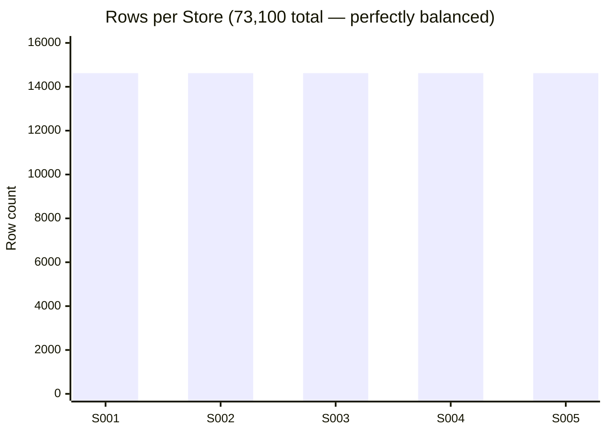

---

## 5. Feature Engineering

### Runtime — `src/preprocessing.py`

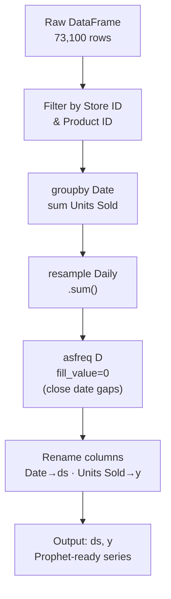

### Notebook analytical features — `EDA_and_Feature_Engineering.ipynb`

| Feature | Derivation | Purpose |
|---|---|---|
| `day` | `Date.dt.day` | Intra-month position |
| `month` | `Date.dt.month` | Monthly seasonality |
| `year` | `Date.dt.year` | Trend direction |
| `day_of_week` | `Date.dt.dayofweek` | Weekly cycles |
| `is_weekend` | `day_of_week >= 5` | Weekend uplift |
| `week_of_year` | ISO week | 52-week pattern |
| `quarter` | `Date.dt.quarter` | Quarterly cycles |

---

## 6. Modelling — Facebook Prophet

### Why Prophet?

- Native multi-seasonality (weekly + yearly) — no manual lag engineering
- Robust to missing values and outliers
- Built-in uncertainty intervals (`yhat_lower`, `yhat_upper`)
- Scales cleanly across 100 independent training runs
- Interpretable decomposition: Trend · Weekly · Yearly

### Configuration

```python
# src/forecasting.py
Prophet(
    yearly_seasonality = True,   # annual demand cycles
    weekly_seasonality = True,   # Mon–Sun sales pattern
    daily_seasonality  = False,  # no sub-day signal at daily grain
)
```

### Additive decomposition

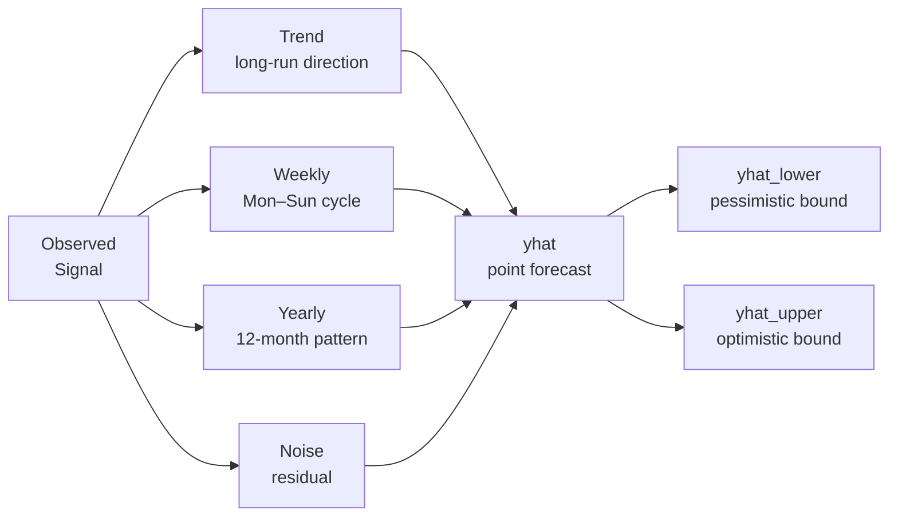

### Forecast output columns

| Column | Description | Used for |
|---|---|---|
| `ds` | Date | Chart x-axis |
| `yhat` | Point forecast | All predictions |
| `yhat_lower` | Lower confidence bound | Date forecast tab |
| `yhat_upper` | Upper confidence bound | Date forecast tab |
| `trend` | Trend component | Decomposition |
| `weekly` | Weekly component | Decomposition |
| `yearly` | Yearly component | Decomposition |

---

## 7. Training Pipeline

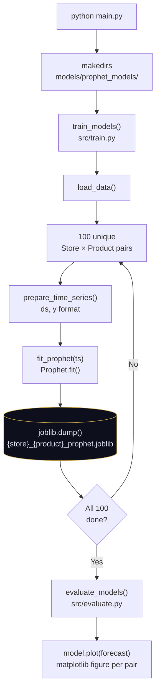

**Run with:**
```bash
python main.py
```

---

## 8. Streamlit Dashboard

**Launch:**
```bash
python -m streamlit run app.py
# → http://localhost:8501
```

The UI has 7 tabs:

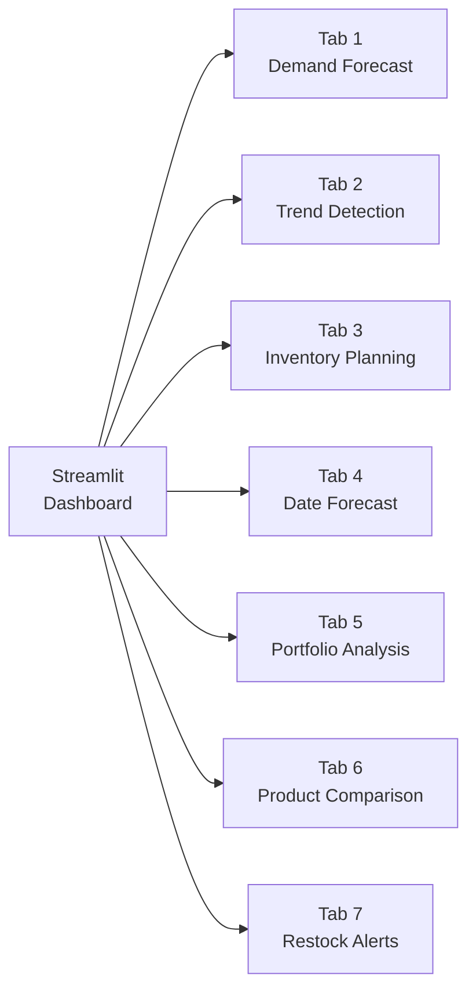

### Tab descriptions

| Tab | Business question | Key output |
|---|---|---|
| **Demand Forecast** | How many units sold next 7 / 30 days? | Line chart + total & avg metric cards |
| **Trend Detection** | Is demand rising or falling? | Trajectory chart + rise / drop / stable alert |
| **Inventory Planning** | How much stock to order next month? | Recommended stock · peak day · avg daily cards |
| **Date Forecast** | What are sales on a specific date? | yhat · yhat_lower · yhat_upper metric cards |
| **Portfolio Analysis** | Which pairs are growing or declining? | Sortable table of avg daily change across all 100 pairs |
| **Product Comparison** | Which product has stronger demand? | Dual-series overlay chart + per-product avg cards |
| **Restock Alerts** | Which pairs need restocking now? | Filtered table of pairs below demand threshold |

---

## 9. REST API — FastAPI

**Launch:**
```bash
uvicorn server:app --reload
# → http://localhost:8000/docs
```

### Endpoints

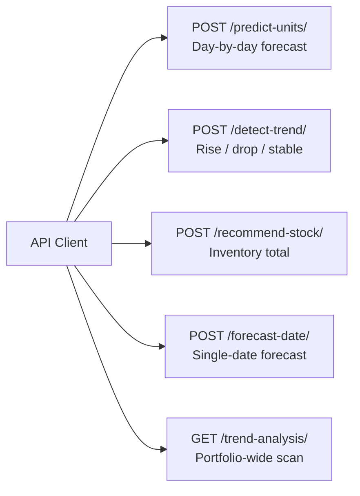

### Request / Response examples

**`POST /predict-units/`**
```json
// Request
{ "store_id": "S001", "product_id": "P0003", "period": 30 }

// Response
[
  { "ds": "2024-01-02", "yhat": 143.7 },
  { "ds": "2024-01-03", "yhat": 138.2 }
]
```

**`POST /detect-trend/`**
```json
// Request
{ "store_id": "S002", "product_id": "P0007", "period": 14 }

// Response
{ "trend": "rise", "avg_change": 2.41 }
```

**`POST /recommend-stock/`**
```json
// Request
{ "store_id": "S003", "product_id": "P0012", "period": 30 }

// Response
{ "recommended_inventory": 4182 }
```

**`POST /forecast-date/`**
```json
// Request
{ "store_id": "S001", "product_id": "P0001", "forecast_date": "2025-06-15" }

// Response
{ "date": "2025-06-15", "predicted_units": 157.34 }
```

**`GET /trend-analysis/`**
```json
// Response (all 100 pairs, sorted descending)
[
  { "store_id": "S004", "product_id": "P0015", "avg_change": 3.87 },
  { "store_id": "S001", "product_id": "P0002", "avg_change": 2.14 }
]
```

---

## 10. Live Demo

<div align="center">

### The app is live — no setup required

[](https://time-series-forecasting-ml-model.streamlit.app/)

**[https://time-series-forecasting-ml-model.streamlit.app/](https://time-series-forecasting-ml-model.streamlit.app/)**

</div>

> The Streamlit Cloud deployment includes all 100 pre-trained Prophet models and the full 7-tab dashboard. No local installation needed.

---

## 11. Usage Guide

| Goal | Command |
|---|---|
| Train all models | `python main.py` |
| Streamlit dashboard | `python -m streamlit run app.py` |
| FastAPI server | `uvicorn server:app --reload` |
| EDA notebook | `jupyter notebook notebooks/EDA_and_Feature_Engineering.ipynb` |
| Evaluate models | `python -c "from src.evaluate import evaluate_models; evaluate_models('data/retail_warehouse_inventory_dataset.csv', 'models/prophet_models')"` |

---

## 12. Model Inventory

100 models trained across **5 stores × 20 products**.

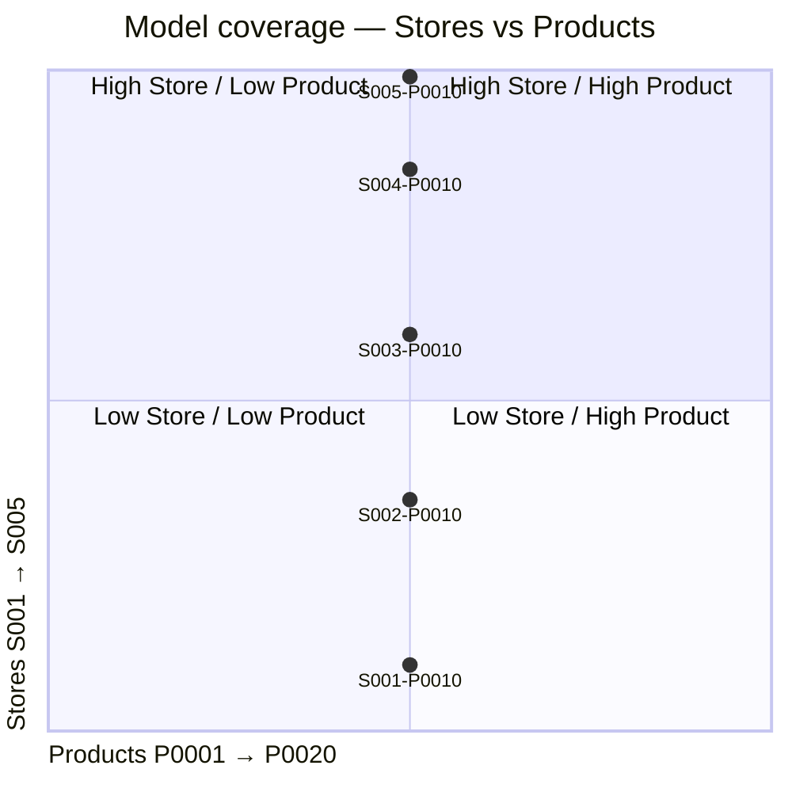

**Naming convention:** `{STORE_ID}_{PRODUCT_ID}_prophet.joblib`
> Example: `S003_P0014_prophet.joblib` — Store 3, Product 14

All models are loaded on-demand via `joblib.load()`. No model is held in memory until requested.

---

## 13. Key Insights

### Data quality
- **Zero nulls** across all 73,100 records — no imputation required
- Every store-product pair has a complete, unbroken 2-year daily series
- High variance in Units Sold (std 108.9 vs mean 136.5) confirms per-pair modelling is essential

### Design decisions

| Decision | Rationale |
|---|---|
| One model per store-product | Retail demand is highly pair-specific; shared models under-perform |
| Weekly seasonality ON | Clear Mon–Sun cycles in retail data |
| Daily seasonality OFF | No sub-day signal at daily grain; enabling adds noise |
| 4-year forecast horizon | Supports multi-year strategic planning without retraining |
| joblib serialisation | Near-zero load latency across all 100 models |

### Forecast horizon reliability

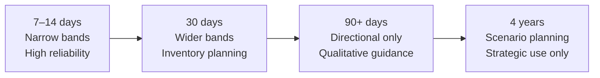

---

## 14. Tech Stack

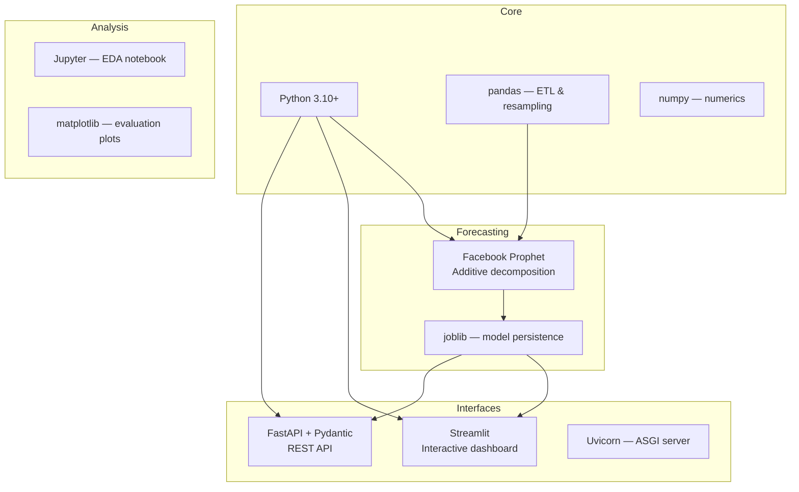

---

<div align="center">

Built with precision. Designed for scale.

</div>
